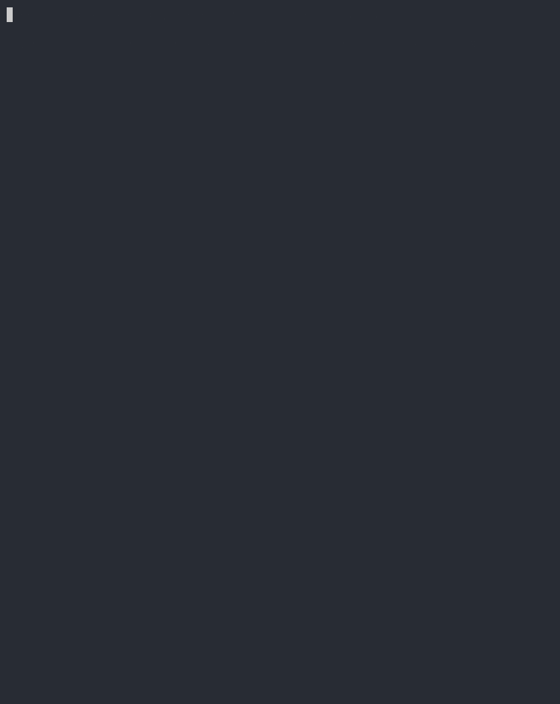
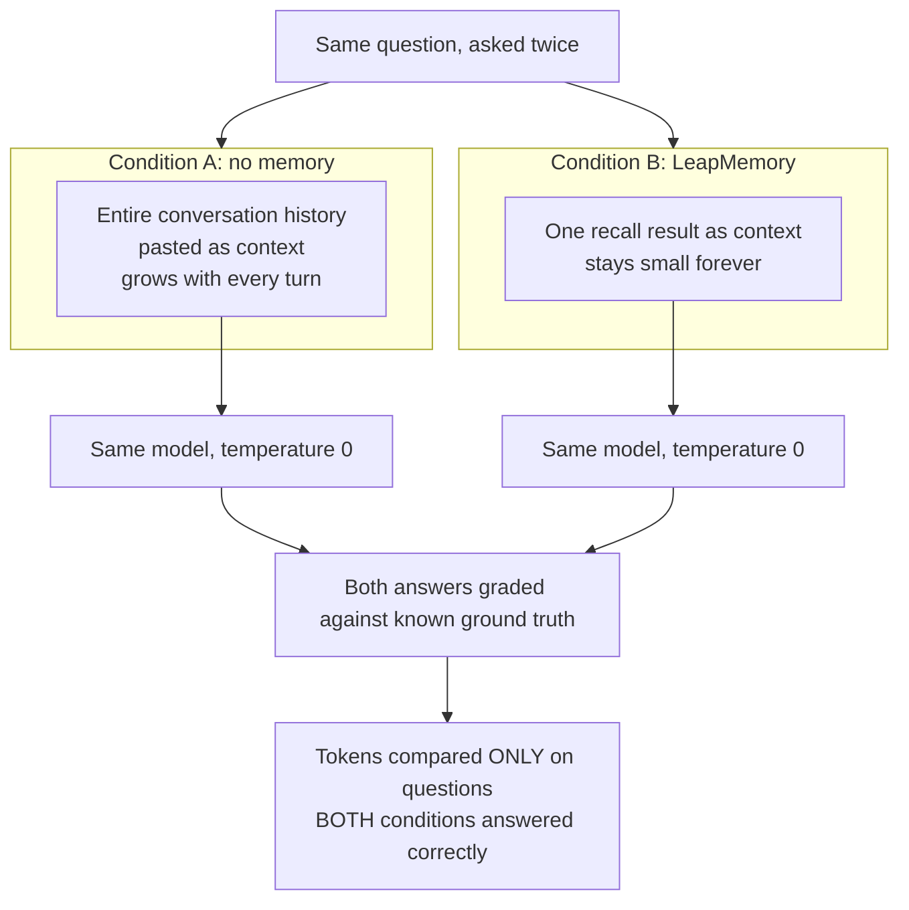
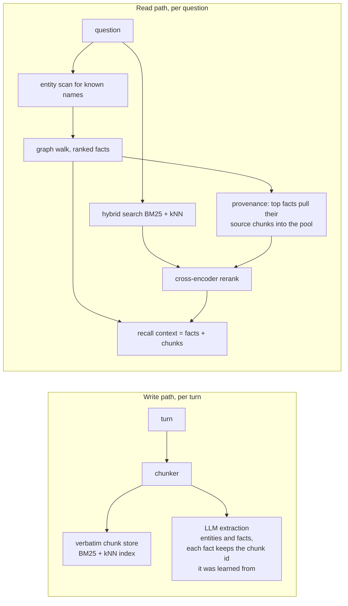

# memory-bench



Same model, same questions, same accuracy. A fraction of the tokens.

This is the open benchmark harness for [LeapMemory](https://leapmemory.com).
Every question is asked twice, and only the context changes:



Token counts come from the provider's bill, never counted locally. The
both-correct gate means a memory-side failure can never inflate the headline:
if recall misses a question, that question is excluded from the reduction
number, not papered over.

## Limits, first

- **Small n.** 30 probes across three corpora. This is a mechanism check, not
  a scale study.
- **Direct-recall questions.** These probes test factual retrieval:
  identifiers, names, numbers, dates, one superseded fact, and abstention.
  See "What this does not test" below.
- **One conversation per corpus.**
- **One model measured.** Results shown are claude-sonnet-4.6. `MODEL` is an
  env var; rerun with any OpenAI-compatible model. Tokenizers differ between
  providers, so absolute percentages shift slightly.
- **The private corpus is not published.** It is the author's own
  conversation history. Its method, per-probe token counts, and full history
  are published; its text is not. The two sample corpora exist so the
  identical harness is verifiable end to end on open data. Better yet:
  export your own conversation, convert it to the jsonl format below, and run
  both conditions on data nobody could have staged.

## Results

| Run | Probes | Baseline acc | Recall acc | Median token reduction |
|---|---|---|---|---|
| [Private, real 59-turn conversation (~25k tokens)](results/2026-07-private-59turn.md) | 10 | 10/10 | 10/10 | 82.6% |
| [Public sample, 98 synthetic turns](results/2026-07-sample_100.md) | 12 | 12/12 | 12/12 | 91.7% |
| [Free-tier quick sample, 28 turns](results/2026-07-sample30.md) | 8 | 8/8 | 8/8 | 78.2% |

All runs at temperature 0: rerun them and the same table prints.

Why three different percentages? Reduction is a ratio, and it grows with
history size, because the paste condition grows linearly while recall stays
flat:

```mermaid
xychart-beta
    title "Input tokens the model reads per question"
    x-axis ["28 turns", "98 turns", "59 dense turns"]
    y-axis "tokens" 0 --> 26000
    bar "pasted history" [725, 2700, 25000]
    bar "LeapMemory recall" [160, 250, 4000]
```



The paste grows with every conversation turn; the recall does not. At some
history size the paste stops fitting in a context window at all.

## Method

One harness, `bench.py`. Per probe:

1. Ask with the full corpus pasted (condition A), record the answer and the
   provider-billed input tokens.
2. Ask LeapMemory recall with the question, build the context from only that
   result, ask again (condition B), record the same two things.
3. Grade both against the expected answer: case-insensitive containment,
   deliberately dumb, every miss printed in full for eye review.

Identical system prompt both sides (visible in `bench.py`): search the context
carefully, answer concisely, reply UNKNOWN only if certain the answer is not
present.

reduction = 1 - (recall context tokens / pasted history tokens), computed
only over probes both conditions answered correctly, reported as the median.

## System under test

So results can be interpreted, not just trusted. LeapMemory ingestion runs
LLM extraction (Claude Sonnet 4.6) over every chunk, building a knowledge
graph alongside verbatim chunk storage; recall combines both:



Embeddings are Qwen3-Embedding-0.6B. No settings were tuned per probe; the
same production configuration serves every query.

## What this does not test

Reasoning and synthesis across memories, contradiction resolution beyond one
superseded fact, temporal reasoning, multi-hop recall, retrieval precision
under thousands of stored memories, and behavior across months of real
usage. Standardized long-memory evaluations (LongMemEval-class) are planned
and will be published under this repository when run.

## Run it yourself

1. Sign up at [app.leapmemory.com](https://app.leapmemory.com/#/signup)
2. API Keys → Create key (role admin, scope project). Copy the `lm_sk_` value
   from the reveal dialog; it is shown exactly once.
3. Add prepaid credits in Billing (any amount; about $1.40 covers the quick
   corpus).
4. Configure and install:

```bash
   git clone https://github.com/leapmemory/memory-bench
   cd memory-bench
   pip install -r requirements.txt
   cp .env.example .env    # add your LeapMemory key and a model provider key
```

5. Run:

```bash
   # quick corpus, 28 turns, 8 probes (~$1.40 in LeapMemory credits)
   python3 bench.py --corpus corpus/sample_30.jsonl --probes probes/sample_30.yaml --ingest

   # full sample, 98 turns, 12 probes (~$4.90 in LeapMemory credits)
   python3 bench.py --corpus corpus/sample_100.jsonl --probes probes/sample_100.yaml --ingest
```

Costs, paid by you: LeapMemory bills $0.05 per memory saved (prepaid
credits; recall is free), plus your model provider's answer calls (small).
`--ingest` creates a fresh benchmark tenant, deletes the previous one it
created, uploads the corpus, waits for extraction, then runs both
conditions. Rerunning without `--ingest` reuses the tenant and only asks
the questions.

Corpus format, one JSON object per line:

```json
{"role": "user", "content": "...", "ts": "2026-01-12T09:14:02Z"}
```

Probe format, YAML list:

```yaml
- id: p01
  question: "..."
  expected: ["substring1", "substring2"]   # ["UNKNOWN"] for abstention probes
```

## Changelog

Developing this benchmark surfaced two retrieval bugs in LeapMemory itself.
Both were fixed in the product, never in the grading; details are in the
results files, including two probe rewordings and why.

## License

MIT.